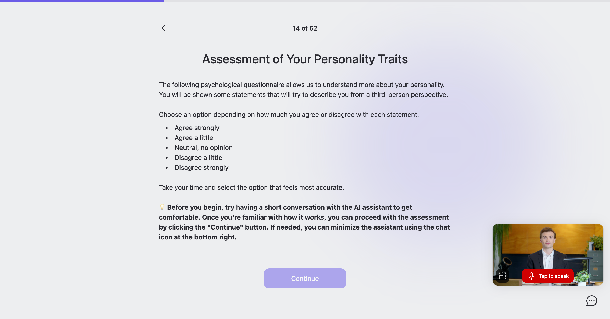

# Talking Surveys: How Photorealistic Embodied Conversational Agents Shape Response Quality, Engagement, and Satisfaction

## About

This repository supports the research paper titled *"Talking Surveys: How Photorealistic Embodied Conversational Agents Shape Response Quality, Engagement, and Satisfaction"*. This research explores how using AI-driven virtual avatars in surveys-compared to standard chatbots-affects participant engagement, satisfaction, and response quality.

### Paper Citation

Not published yet.

### Contents

- [About](#about)  
- [Dataset](#dataset)  
- [Scripts](#scripts)  
- [Study materials](#study-materials)
- [Interface](#interface)
- [Authors](#authors)  
- [License](#license)

## Dataset

Data from 80 participants was gathered using [UXtweak's user panel](https://www.uxtweak.com/user-participant-recruitment). The exports from the Virtual Agent Interviewer online survey tool can be found in the [data directory](./analysis/data/):
- **[Questionnaire answers](./analysis/data/answers.csv)**  
  Contains participants’ answers to demographic questions, questionnaire items, and post-study questions.
- **[Assistant chats](./analysis/data/chats.csv)**  
  Includes details about individual chats with AI assistants, such as session durations and notes taken after the chat.
- **[Messages](./analysis/data/messages.csv)**  
  Lists each message exchanged with the AI assistant, along with time durations, word and character counts, and informativeness scores.
- **[Participants](./analysis/data/respondents.csv)**  
  Provides basic information about participants, including their assigned variant, chosen avatar, and total time spent.

Additionally, two labeled dataset are available:
- **[Automatically labeled messages](./analysis/data/messages-auto-labeled.csv)**  
  Builds on the messages file by adding labels for specificity, relevance, clarity, sentiment, and self-disclosure. GPT-4.1 is utilized for the labeling task.
- **[Labeled messages](./analysis/data/messages-labeled.csv)**  
  Final labels reviewed and fixed by UX researcher.


## Scripts

See below for guidelines on configuring the virtual environment used for data analysis and explanation of key scripts found in the file structure.


### Environment 

All of the scripts located in the analysis folder are written using Python (version 3.12.1) and other external libraries installed using pip (version 23.2.1). Scripts were executed using jupyter notebooks in VS Code. A [requirements file](./analysis/requirements.txt) is provided for installing dependencies. After installing Python, the below commands can be used in the [analysis](./analysis/) directory to install the environment:
```
python -m venv .venv
.venv\Scripts\activate
pip install -r requirements.txt
```

On macOS devices, this process could be slightly different:
```
python3 -m venv .venv
source .venv/bin/activate
pip3 install -r requirements.txt
```

This will create your virtual environment and install the dependencies. After the installation, notebooks could be executed in any available IDE (IDEs such as VS Code, in which the environment could be even installed automatically) or using the built-in web environment using this command in the command line (while having activated the virtual environment using `.venv\Scripts\activate` or `source .venv/bin/activate`):
```
jupyter notebook
```


### Files

Following files are present in the [analysis directory](./analysis/):

- **[Data preparation](./analysis/1_preparation.ipynb)**  
  Fixing response typos and calculating variables.
- **[Data labeling](./analysis/2_labeling.ipynb)**  
  Applying GPT to label responses.
- **Exploratory data analysis:**  
  - **[Participant data](./analysis/3-1_EDA-respondents.ipynb)**  
    Overview of participants.  
  - **[Chat data](./analysis/3-2_EDA-chats.ipynb)**  
    Analysis of chat sessions.  
  - **[Messages data (quantitative)](./analysis/3-3_EDA-messages-quant.ipynb)**  
    Quantitative analysis of messages.
  - **[Messages data (qualitative)](./analysis/3-4_EDA-messages-qual.ipynb)**  
    Qualitative analysis of messages.
- **[Utility methods](./analysis/utils.py)**  
  Contains imports and utility functions used throughout the analysis.


## Study materials

Note: Italic text in this chapter indicates alternative options (x/y) based on the study variant.

### Consent

Before we can proceed, we require your explicit consent for your participation and processing of your data. Please be assured that your responses will remain fully anonymous and will only be used for research purposes. No personally identifiable information will be collected or stored. By clicking "I Agree", you provide your full and voluntary consent to the collection, processing and publication of your anonymized data.

### Welcome message

**Welcome to Our Survey!**\
We appreciate having you as a participant. This survey is about exploring your *personality/cognitive* traits and how they influence your thoughts, behaviors, and everyday life. In all questions, we are looking for your unique personal perspective, there are no right or wrong answers. Take your time and be honest. We hope you will enjoy the process.

**What to Expect**
- Profiling: Fill in a few questions about yourself.
- *Personality/Cognitive* Assessment: Answer a series of questions designed to uncover key *personality/cognitive* traits and patterns.
- Your Results: Get a summary of your *personality/cognitive* profile based on your responses.
- Feedback: Share your thoughts about the survey experience.

**Interactive Assistance**\
Our AI Assistant is here to guide you through the survey. You will see it pop up from time to time to:
- Ask you some follow-up questions so we better understand your answers.
- Clarify anything you'd like to ask about before we start.
- Assist in interpreting your results.

**Interacting with the AI assistant is a required part of the experience.**

**Guidelines**\
To ensure a smooth interaction with your AI assistant, please keep the following in mind:
- *Microphone Access: You'll need to grant microphone access for voice interaction.*
- *Optimal Environment: Choose a quiet space free from distractions to ensure clear communication.*
- Stay on Topic: When the assistant asks you a question, keep your responses relevant.
- Provide Detailed Answers: Avoid overly short responses. Thoughtful and clear answers help improve the experience.
- Processing Times: Some responses may take a moment to process. Please be patient.

**Time Commitment**\
Completing the survey will take approximately *15-25/20-30* minutes. Your time and effort are greatly appreciated!


### Initial questionnaire

| Question | Options |
|---|---|
| What is your age? | Under 18<br> 18-24<br> 25-34<br> 35-44<br> 45-54<br> 55 and above |
| Which gender do you identify as? | Male<br> Female<br> Nonbinary |
| How do you identify yourself in terms of race? | Asian or Pacific Islander<br> Black<br> Hispanic or Latino/a/x<br> Indigenous<br> Middle Eastern or North African<br> White<br> Other |
| What is the highest education level you have completed? | None completed<br> Primary education<br> Secondary education<br> High school diploma<br> Technical/community college<br> Undergraduate degree<br> Graduate degree<br> Doctoral degree |
| What is your personal income per year, after tax? | No income<br> £0 - £9,999<br> £10,000 - £19,999<br> £20,000 - £29,999<br> £30,000 - £39,999<br> £40,000 - £49,999<br> £50,000 - £74,999<br> £75,000 - £100,000<br> More than £100,000 |
| How often do you use a computer? | Multiple times a day<br> At least once a day<br> At least once a week<br> At least once a month<br> Less often |
| What is your general attitude towards artificial intelligence? | Very positive<br> Somewhat positive<br> Neutral<br> Somewhat negative<br> Very negative |
| Have you previously interacted with AI-based conversational agents (e.g., chatbots, virtual assistants, avatars) in online surveys or other platforms? | Yes<br> No<br> Not sure |
| How would you rate your overall proficiency in English? | Native or bilingual speaker<br> Advanced<br> Intermediate<br> Basic<br> Beginner |
| You may love pizza or ice cream. But when we ask you what you would order in the restaurant, you need to choose a salad. Based on the text above, what is a meal you would order in a restaurant? | Pizza<br> Ice cream<br> Spaghetti <br>Salad<br> Fish and chips <br>Hamburger<br> Lasagna <br>Other |

### Instructions

**Assessment of Your *Personality/Cognitive* Traits**\
The following psychological questionnaire allows us to understand more about your *personality/cognition*. You will be shown some *statements that will try to describe you from a third-person perspective/questions about things that happen to you in your everyday life*.

Choose an option depending on how *much you agree or disagree with each statement/often each situation occurred to you in the past 6 months*:
- *Agree strongly/Very often*
- *Agree a little/Quite often*
- *Neutral, no opinion/Occasionally*
- *Disagree a little/Very rarely*
- *Disagree strongly/Never*

Take your time and select the option that feels most accurate.

**Before you begin, try having a short conversation with the AI assistant to get comfortable. Once you're ready, you can continue with the assessment.**

### Assistant during instructions

Hey there! I'll be your assistant throughout this survey. Got any questions before we start?

### BFI-2-S questionnaire

- Main question: **I am someone who...**
- Scales: Openness (O), Conscientiousness (C), Extraversion (E), Agreeableness (A), and Neuroticism (N)

| Order | Question | Scale | Assistant follow-up |
|---|---|---|---|
| 1 | Tends to be quiet. | E | Being quiet or talkative can shape how we connect with others. Have you noticed how often you talk affects the interactions with people around you? |
| 2 | Is compassionate, has a soft heart. | A |  |
| 3 | Tends to be disorganized. | C |  |
| 4 | Worries a lot. | N |  |
| 5 | Is fascinated by art, music, or literature. | O | Art, music, and literature can really shape our lives in unique ways. How do they influence your day-to-day experiences or the way you see the world? |
| 6 | Is dominant, acts as a leader. | E |  |
| 7 | Is sometimes rude to others. | A |  |
| 8 | Has difficulty getting started on tasks. | C | Getting started on things can be tough sometimes. Do you find certain types of tasks harder to begin than others? What helps you push through when that happens? |
| 9 | Tends to feel depressed, blue. | N | What factors negatively influence your mood? Is there anything you do to help manage it? |
| Attention check | I prefer summer over winter. Some participants rush through surveys without carefully reading the questions, which affects data quality. To show you're paying attention, please select both 'Agree strongly' and 'Disagree strongly' in this question. |  |  |
| 10 | Has little interest in abstract ideas. | O |  |
| 11 | Is full of energy. | E | Having a lot of energy can shape your day in different ways. How do you usually channel your energy? Are there moments when it feels like too much or not enough? |
| 12 | Assumes the best about people. | A |  |
| 13 | Is reliable, can always be counted on. | C |  |
| 14 | Is emotionally stable, not easily upset. | N | Is there anything you'd like to improve at, in regards to emotional stability? |
| 15 | Is original, comes up with new ideas. | O |  |
| 16 | Is outgoing, sociable. | E |  |
| 17 | Can be cold and uncaring. | A | Have you noticed times when you feel more distant or detached? How do you think that impacts your relationships? |
| 18 | Keeps things neat and tidy. | C | Do you usually stick to a set routine to stay organized, or do you prefer taking things one step at a time? |
| 19 | Is relaxed, handles stress well. | N |  |
| 20 | Has few artistic interests. | O |  |
| 21 | Prefers to have others take charge. | E |  |
| 22 | Is respectful, treats others with respect. | A | Respect can mean different things to different people. What does treating others with respect look like to you in daily life? |
| 23 | Is persistent, works until the task is finished. | C |  |
| 24 | Feels secure, comfortable with self. | N |  |
| 25 | Is complex, a deep thinker. | O |  |
| 26 | Is less active than other people. | E |  |
| 27 | Tends to find fault with others. | A |  |
| 28 | Can be somewhat careless. | C |  |
| 29 | Is temperamental, gets emotional easily. | N |  |
| 30 | Has little creativity. | O | Can you name any situation that has allowed you to express yourself creatively and how? |

### CFQ questionnaire

- Main question: **How often these things have happened to you in the past 6 months?**
- Scales: Forgetfulness (F), Distractibility (D) and False Triggering (FT)

| Order | Question | Scale | Assistant follow-up |
|---|---|---|---|
| 1 | Do you read something and find you haven't been thinking about it and must read it again? | F |  |
| 2 | Do you find you forget why you went from one part of the house to the other? | F, FT | Can you recall any situations when your purpose for being in a room skipped your mind? Do you have any explanation for why it happened? |
| 3 | Do you fail to notice signposts on the road? | FT |  |
| 4 | Do you find you confuse right and left when giving directions? |  |  |
| 5 | Do you bump into people? | F, FT |  |
| 6 | Do you forget whether you've turned off a light or a fire or locked the door? | FT | Are there any specific switches or locks that you forget about, or does it happen in general. Do you have any little routines or reminders to help you? |
| 7 | Do you fail to listen to people's names when you are meeting them? | F | Remembering names can be effortless for some and tricky for others. Are there people whose names you find easier or harder to remember? |
| 8 | Do you say something and realize afterwards that it might be taken as insulting? | D |  |
| 9 | Do you fail to hear people speaking to you when you are doing something else? | D | Balancing attention between tasks and conversations can vary from person to person. How do you usually manage focus when you're engaged in something? |
| Attention check | Do you go to summer vacations? Some participants rush through surveys without carefully reading the questions, which affects data quality. To show you're paying attention, please select both 'Very often' and 'Never' in this question. |  |  |
| 10 | Do you lose your temper and regret it? | D |  |
| 11 | Do you leave important letters unanswered for days? | D |  |
| 12 | Do you find you forget which way to turn on a road you know well but rarely use? | FT |  |
| 13 | Do you fail to see what you want in a supermarket (although it's there)? |  |  |
| 14 | Do you find yourself suddenly wondering whether you've used a word correctly? | D |  |
| 15 | Do you have trouble making up your mind? |  |  |
| 16 | Do you forget appointments? |  |  |
| 17 | Do you forget where you put something like a newspaper or a book? | F | Some people prefer to keep things in the same spot, while others leave them wherever they last used them. What approach works best for you, and why do you think that is? |
| 18 | Do you accidentally throw away the thing you want and keep what you meant to throw away? | FT |  |
| 19 | Do you daydream when you ought to be listening to something? | D | It's common for people to experience moments of distraction. Do you recall situations when it happens to you? |
| 20 | Do you forget people's names? | F |  |
| 21 | Do you start doing one thing at home and get distracted into doing something else? | D |  |
| 22 | Do you find you can't quite remember something although it's on the tip of your tongue? | F | Do you have any techniques to help you remember? How important are the things that you forget like this? |
| 23 | Do you forget what you came to the shops to buy? | F, FT | When it comes to remembering what you need at the store, do you have a go-to trick or routine? Or do you just wing it and hope for the best? |
| 24 | Do you drop things? | FT |  |
| 25 | Do you find you can't think of anything to say? | D | Some conversations flow easily, while others can be more challenging. Do you notice any patterns in what makes a conversation feel easier or harder to engage in? |

### Final feedback questionnaire

| Question | Options |
|---|---|
| How do you agree with this statement: The conversation with the AI assistant felt natural. | Strongly agree<br> Agree<br> Neutral<br> Disagree<br> Strongly disagree |
| How would you rate the overall experience of interacting with the AI assistant? | Very good<br> Good<br> Neutral<br> Poor<br> Very poor |
| How would you rate your overall experience with this survey? | Very good<br> Good<br> Neutral<br> Poor<br> Very poor |
| During this survey, you interacted with a text-based AI assistant. If you had to choose, would you prefer this format or a voice-based assistant (where the AI speaks to you, and you also respond by speaking) for a similar survey in the future? | I'd prefer the *text/voice*-based AI assistant (current version)<br> I'd prefer the *text/voice*-based AI assistant (the alternative)<br> I have no preference |
| How many months are there in a year? Even though the correct answer is twelve, make sure to choose the option thirty. | 1<br> 7<br> 12<br> 30<br> 365<br> Other |
| Is there anything else you’d like to tell us regarding this study? |  |


## Interface

### Screenshots

<table>
  <tr>
    <td style="text-align: center;">
      
      <p style="text-align: center;">Embodied variant.</p>
    </td>
    <td style="text-align: center;">
      
      <p style="text-align: center;">Text-based variant.</p>
    </td>
  </tr>
</table>

### Avatars

<table>
  <tr>
    <td style="text-align: center;">
      
      <p style="text-align: center;">Ann.</p>
    </td>
    <td style="text-align: center;">
      
      <p style="text-align: center;">Judy.</p>
    </td>
  </tr>
  <tr>
    <td style="text-align: center;">
      
      <p style="text-align: center;">June.</p>
    </td>
    <td style="text-align: center;">
      
      <p style="text-align: center;">Shawn.</p>
    </td>
  </tr>
  <tr>
    <td style="text-align: center;">
      
      <p style="text-align: center;">Silas.</p>
    </td>
    <td style="text-align: center;">
      
      <p style="text-align: center;">Wayne.</p>
    </td>
  </tr>
</table>

## Authors

### General contact 

Email: 
moderated.survey.research@gmail.com

**Matus Krajcovic**\
User experience researcher at [UXtweak](https://www.uxtweak.com/) and PhD student at [Faculty of Informatics and Information Technologies](https://www.fiit.stuba.sk/), [Slovak University of Technology in Bratislava](https://www.stuba.sk/). Currently focuses on data analysis and research in machine learning use in the field of human-computer interaction.

- Email: matus.krajcovic([AT])uxtweak.com

**Peter Demcak**\
Researcher with background in software engineering, whose current topics of interest involve user behavior, human-computer interaction, UX research methods and design practices, and machine learning. Currently occupies the position of a scientific and user experience researcher at [UXtweak](https://www.uxtweak.com/), with focus on research that supports work of UX professionals.

- Email: peter.demcak([AT])uxtweak.com

**Eduard Kuric**\
He is a researcher and lecturer at [Faculty of Informatics and Information Technologies](https://www.fiit.stuba.sk/), [Slovak University of Technology in Bratislava](https://www.stuba.sk/). His research interests include human-computer interaction analysis, user modeling, personalized web-based systems, and machine learning. Eduard is also the head of the UX Research Department and the founder of [UXtweak](https://www.uxtweak.com/).
- [LinkedIn](https://www.linkedin.com/in/eduard-kuric-b7141280/)
- [Google Scholar](https://scholar.google.com/citations?user=MwjpNoAAAAAJ&hl=en&oi=ao)
- Email: eduard.kuric([AT])stuba.sk


## License
This work is licensed under a [Creative Commons Attribution-NonCommercial 4.0 International License](http://creativecommons.org/licenses/by-nc/4.0/).

[](http://creativecommons.org/licenses/by-nc/4.0/)
